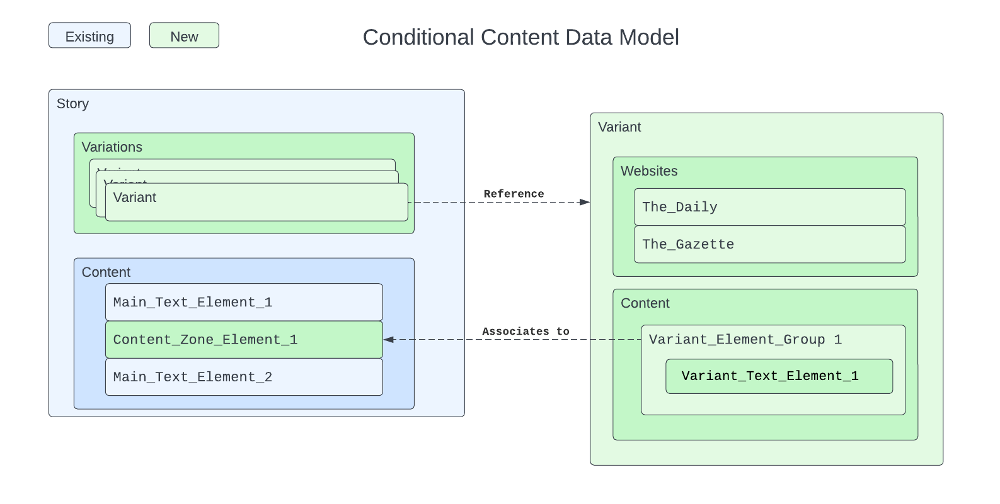
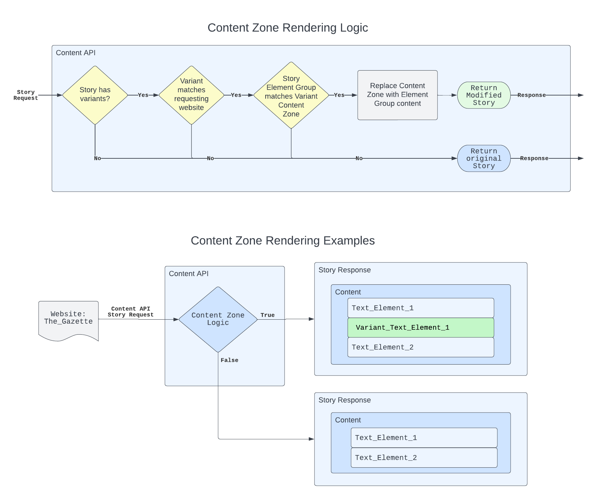

# Conditional Content

Version>=0.10.9

# Problem

Editors need to be able to author alternate versions of a single story without blocking each other.  There is no way to render alternate versions of a single story for specific websites.

# Proposal

This document proposes changes to support conditional content in a story.  When a story is request in Content API, the content will render differently depending on editor defined conditions.  The the content of the story variations can be edited in parallel by multiple editors without locking each other out. 

* A new `variant` object defining conditional content data for a story. 
  * [/ans/0.10.9/utils/variant.json](https://github.com/washingtonpost/ans-schema/blob/master/src/main/resources/schema/ans/0.10.9/utils/variant.json)
* A new `content_zone` story element representing a location for `variant` content within a story.
  * [/ans/0.10.9/story_elements/content_zone.json](https://github.com/washingtonpost/ans-schema/blob/master/src/main/resources/schema/ans/0.10.9/story_elements/content_zone.json)
* A new `variations` field on the story object that contains references to the associated `variant` data.
  * [/ans/0.10.9/traits/trait_variations.json](https://github.com/washingtonpost/ans-schema/blob/master/src/main/resources/schema/ans/0.10.9/traits/trait_variations.json)



**Limitations**
* Only websites are supported as a condition.  Future conditions would need additional changes to the ANS spec.
* Revisions of conditional content are not supported.  This will likely require future changes to the ANS spec.

# Details

## Modified/Added Schema

* [/ans/0.10.9/content_operation.json]https://github.com/washingtonpost/ans-schema/blob/master/src/main/resources/schema/ans/0.10.9/content_operation.json
* [/ans/0.10.9/story.json]https://github.com/washingtonpost/ans-schema/blob/master/src/main/resources/schema/ans/0.10.9/story.json
* [/ans/0.10.9/story_elements/content_zone.json]https://github.com/washingtonpost/ans-schema/blob/master/src/main/resources/schema/ans/0.10.9/story_elements/content_zone.json
* [/ans/0.10.9/traits/trait_variations.json]https://github.com/washingtonpost/ans-schema/blob/master/src/main/resources/schema/ans/0.10.9/traits/trait_variations.json
* [/ans/0.10.9/utils/variant.json]https://github.com/washingtonpost/ans-schema/blob/master/src/main/resources/schema/ans/0.10.9/utils/variant.json

## Variant object

[/ans/0.10.9/utils/variant.json](https://github.com/washingtonpost/ans-schema/blob/master/src/main/resources/schema/ans/0.10.9/utils/variant.json)

A `variant` defines a condition and content combination associated with a story.  The condition of a `variant` is defined by the "websites" field.  The content of a `variant` is defined as a story object in the "content" field.  A story may have 0 or many `variant`s.  

```javascript
variant = {
    // Condition of the variant is a list of one or more websites
    "websites": [            
        "TheGazette",
        "TheDaily"
    ],

    // Content of the variant is an ANS Story object
    "content": {
        "type": "story",
        "version": "0.10.9",
        "content_elements": [
            {
                "_id": "AAAAAA111111AAAAAA111111",
                "type": "element_group",
                "content_elements": [
                    {
                        "content": "Some data for content_zone AAAAAA111111AAAAAA111111",
                        "type": "text"
                    }
                ]
            }
        ]
    },

    // User fields
    "name": "My Variant 1",                           
    "published": false,                             

    // Read-only meta-data
    "type": "variant",
    "publish_date": "2022-10-09T07:20:50.00Z",
    "created_date": "2022-10-08T08:18:50.00Z",
    "last_updated_date": "2022-10-09T07:20:50.00Z"
}
```

## Content Zone story element

[/ans/0.10.9/story_elements/content_zone.json](https://github.com/washingtonpost/ans-schema/blob/master/src/main/resources/schema/ans/0.10.9/story_elements/content_zone.json)

To enable editors to place `variant` content into the main story content, we are introducing a new `content_zone` story element.

A `content_zone` can be used as a story content element to define where `variant` content will be added to the story.  A `variant` may contain an `element_group` which references a `content_zone` in the main story content.  When the main story is requested in Content API, the `content_zone` element of the story will be replaced with the `element_group` content.  

Below is an example ANS object of a story with a `content_zone` content element.  The `content_zone` references the `element_group` of the `variant` defined in the previous section.

```javascript
    story = {
        "type": "story",
        "version": "0.10.9",
        "canonical_website": "TheGazette",
        "content_elements": [
            {
                "_id": "AAAAAA111111AAAAAA111111",
                "type": "content_zone",
                "additional_properties": {
                    "comments": [
                        "This content_zone may be replaced by an element_group from a variant"
                }
            }
        ]
    }
```



## Variations story element

[/ans/0.10.9/traits/trait_variations.json](https://github.com/washingtonpost/ans-schema/blob/master/src/main/resources/schema/ans/0.10.9/traits/trait_variations.json)

To get the associated `variant`s of a story, we are introducing a new read-only `variations` field on the story object.

The `variations` field contains the relationships between a story and its list of `variant`s.  It also contains a list of all `content_zone`s within the story content.  This information is added to the story object as a convenience and optimization for ANS consumers using conditional content.  It is a read-only field on the story object.  Data included in the `variations` field will be ignored for updates to a story object.  In order to maintain ANS document size limitations, `variant` data in a story `variations` field does *not* include its "content" field.

```javascript
    revision = {
        "type": "story",
        "version": "0.10.9",
        "canonical_website": "TheGazette",
        "content_elements": [
            {
                "_id": "AAAAAA111111AAAAAA111111",
                "type": "content_zone"
            }
        ],
        
        // Read only list of references to variants and content_zones
        "variations": {
            "variants": [
                {
                    "_id": "Q523SZMO6NHORGJJJR6USCS2O4",
                    "created_date": "2023-01-09T03:50:38.318Z",
                    "last_updated_date": "2023-01-09T03:50:38.318Z",
                    "name": "test variant",
                    "published": false,
                    "type": "variant",
                    "websites": [
                        "TheGazette"
                    ]
                    // Note the "content" field is not returned for variants
                }
            ],
            "content_zone_ids": [
                "AAAAAAAAAAAAAAAAAAAAAAAAAA"
            ]
        }
    }
```

# Content Replacement Scheme

In general, the particulars of how variant content replaces content in the
original story is a matter of the content authoring and rendering tools'
implementations.

However, the initial planned support within the Arc system is specified below.
Any custom implementation of Conditional Content should follow the guidelines to
ensure compatibility.  Only the fields delineated below will be initially
supported.

## Content Elements

The [Content Zone story element](#content-zone-story-element) section above
outlines the `content_zone` element, which can be placed within the
`content_elements` array of the original story.  These elements must have
their `_id` field filled with a value.  This value must be unique within the
context of this story's `content_elements`.

The [variant data](#variant-object)'s `content` field holds a minimal story
with its `content_elements` populated only with the replacement content.  For
each `content_zone` in the original story, the variant `content_elements`
may optionally contain an element with its `_id` filled with the same value
from a corresponding `content_zone` element.  Though the replacement element
may technically be any schema-compliant element, the `element_group` is the
expected element type in the initial implementation.

If a `content_zone` does not have a corresponding value in the variant
content, it will be removed in the final rendering of the original story.  The
order of the `content_zone`'s `_id` values will match the ordering in the
variant's replacement data.

## Featured Media

The original story's `promo_items.basic` field can be replaced by simply
populating the variant's `content.promo_items.basic` field with an image
[reference](https://github.com/washingtonpost/ans-schema/blob/master/src/main/resources/schema/ans/0.10.9/utils/reference.json).
The `basic` field is the only one within the `promo_items` object that is
currently supported for replacement.

## Tags

The `taxonomy.tags` field in the original story is not replaced by the
variant's values, but instead supplemented.  These auxiliary tags will be
populated in the variant's `content.taxonomy.tags` field.

While there will be an effort to eliminate duplicate tags between the original
story and the variant content in the rendering tier, it is not likely to be
perfect. This is due to the
[tag schema](https://github.com/washingtonpost/ans-schema/blob/master/src/main/resources/schema/ans/0.10.9/utils/tag.json)
itself. The `_id` field would be the ideal basis to determine uniqueness, but
the only `text` field is required.  Ultimately, the authoring system is the
best sentinel of uniqueness.

The additional tags will render after the original story's tags.

# Concerns

## What considerations have been made for backwards and forwards compatibility.

All changes are additive to ANS.  Previous versions of all ANS objects will be compatible with these changes.

For future compatibility, variations may define fields for new conditions beyond websites.  We expect revisions for Variants in the future.

## Why make the variations field read-only?

To help improve collaborative editing, `variant`s are designed for editing independent of the main story.  However, to support ANS consumers it helps to include variant data on the story object.  To maintain collaborative editing while also supporting publishing API consumers, the `variations` field was designed as read-only.  Variants will have an update API endpoint separate from the story object.

## Why not maintain story variant data in the story?

As noted, tightly coupling the story and variant content makes collaborative editing more complicated for users.  The intent of this feature is to be used in parallel by multiple editors.  There are also concerns about ANS document size limits if all content from all `variant`s are included in the story object.

## What are limits of new features?

A story may have up to 30 `variant`s and up to 10 `content_zones`.

# Alternatives considered

## "Smart Clone" story variations instead of "content_zones"

In this solution, a story would be "cloned" but maintain "smart" references back to the content of the original story.  Changes between the two stories would be synchronized.  This was ultimately ruled out because of increased complexity and not as strong of a product fit for ARC.

# Implementation

Publishing Platform team will implement authoring support in Draft API and rendering support in Content API for this feature.
